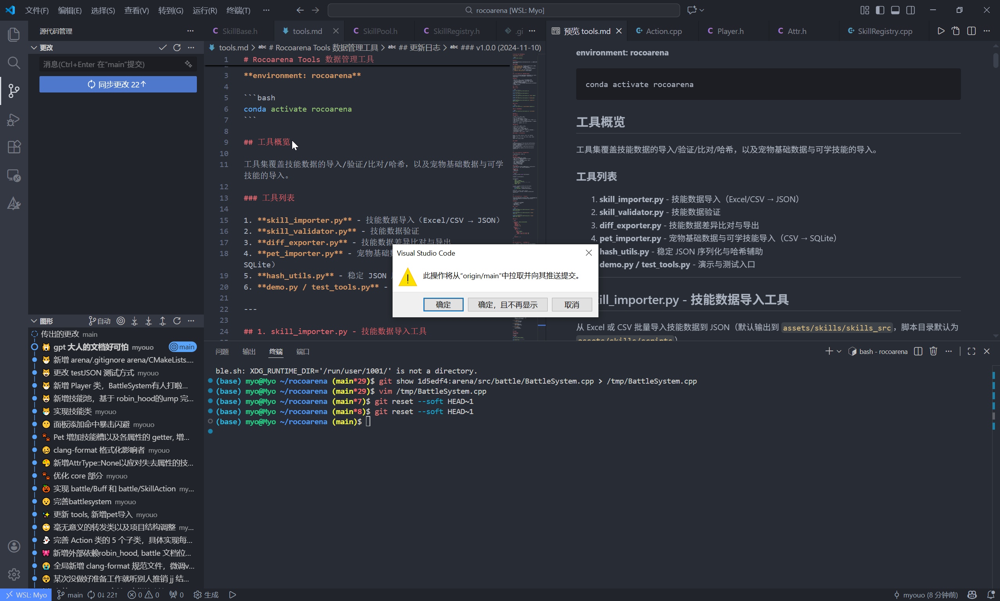

# RocoArena · 开发日志（DEVLOG）

> 用于记录 RocoArena 的开发过程、机制研究、踩坑与阶段性结论。  
> 内容偏向过程记录，不保证结论完全正确。

---

## 记录规范（给未来的自己）

- 每次开发 **只写日期，不强制每天**
- 每个日期下只写发生过的事
- 能写一句就写一句，别追求完整
- ❗重要决策 / 机制结论要单独标记

---

## 2025-12-18

目前主要在梳理战斗机制，发现暴击率这块问题比较大。

已知的两种说法：
- Wiki 里提到基础暴击率为 $\frac{1}{16}$，且不可被抗暴装抵消  
  装备每点暴击属性提供 $0.05\%$ 暴击率  
  https://rocokingdom.huijiwiki.com/wiki/%E6%9A%B4%E5%87%BB

- Bilibili 有大佬通过回归分析得到一个线性模型：$  y = 0.000842x + 0.0441$
  https://www.bilibili.com/opus/577369666173886375

暂时无法确认哪种更贴近现行版本，后续可能需要自己做测试或找更多数据。

命中率这块先存两个链接，明天继续看：
- https://www.bilibili.com/opus/190582254568035616
- https://news.4399.com/gonglue/luoke/miji/691270.html

另外发现自己好像忘了加回避的强化面板，之后补。

---

一口气 push 了 22 个 commit，真的爽 🐱

以及发现今天的 star 居然多了一位！感谢所有 star 本项目的朋友，动力 +1 😽
