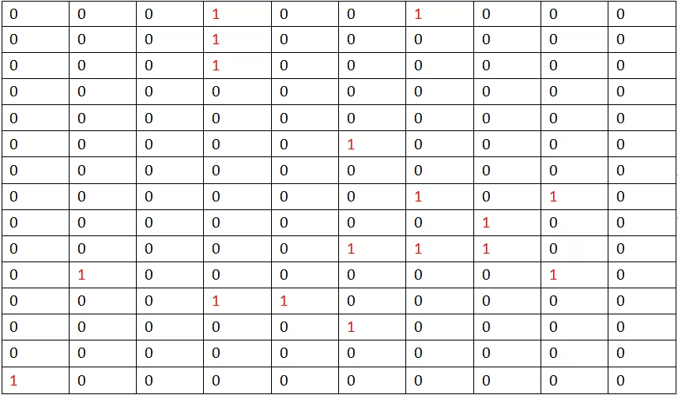
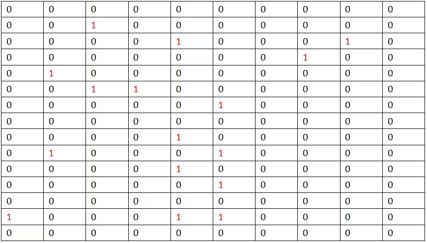
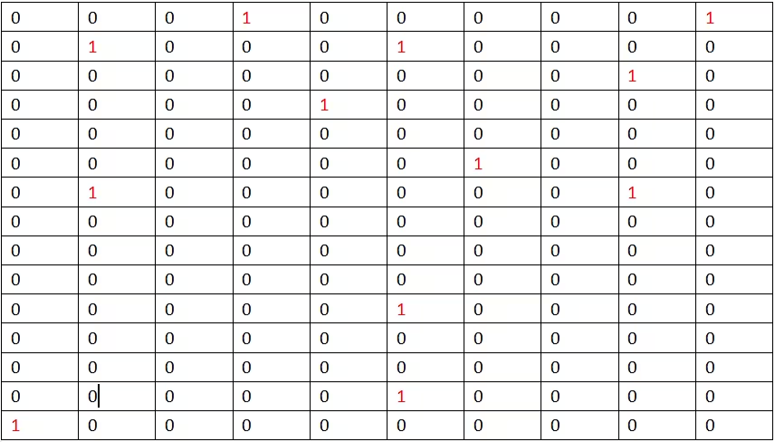
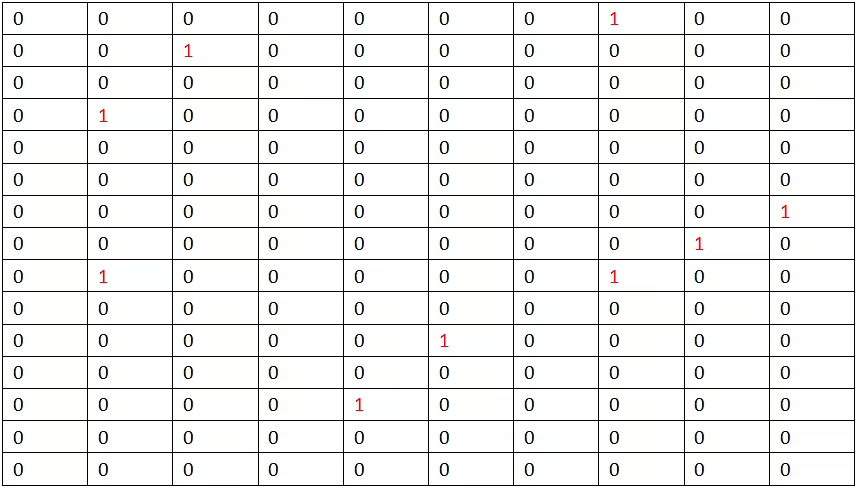
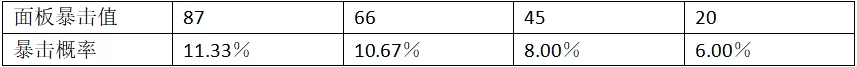
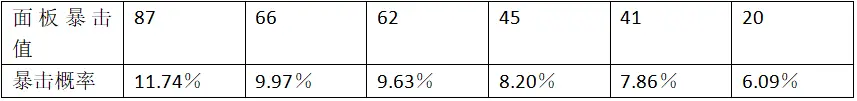

# 关于洛克王国暴击机制的进一步分析（暴击值与暴击概率关系的定量探究）
## author: [嘉言今天贤行了吗](https://www.bilibili.com/opus/577369666173886375)

### 一、问题背景：

在《关于洛克王国暴击机制的初步分析》一文中，通过实验与计算，初步得出结论：洛克王国宠物属性的面板暴击值会显著提升宠物的暴击概率，并且不对暴击伤害产生影响。在上一文的结尾，我推测暴击值与暴击概率呈线性相关关系，因此，这次，我专门增加数据测试了不同暴击值下的暴击概率，定量计算求出暴击值与暴击概率的关系函数。

### 二、实验过程以及原始数据

测试宠物：圣湮伊莱娜

测试所用技能：沉彩飞光（90威力光系物理技能），烬灭响绝（100威力火系物理技能）

（两个技能都没有与暴击相关的额外效果）

实验过程：使用测试宠物用测试技能清理威廉古堡和宠物园两个地图的野怪（涉及宠物：蹦蹦种子，蒲公英，独角仙，贝瑟，面包嘟嘟，丢丢，小地狱犬，独眼怪，乌达），观察测试技能的每次攻击，记录是否暴击。通过多次更换装备改变宠物面板暴击值，每个暴击值一共测试150组数据。

实验所得原始数据如下（表格中0代表此次攻击未暴击，1代表此次攻击产生暴击）：

（1）面板暴击值87

暴击概率：17÷150=11.33％

（2）面板暴击值66

暴击概率：16÷150=10.67％

（3）面板暴击值45

暴击概率：12÷150=8.00％

（4）面板暴击值20

暴击概率：9÷150=6.00％

三、数据整理与拟合：

做出面板暴击值与暴击概率的表格和散点图：

由散点图可以看出，面板暴击值与暴击概率，近似呈线性相关，于是尝试线性拟合，得出二者大致的函数关系式。

利用计算机，拟合得到 $y=0.000842x+0.0441$

并利用计算机计算线性相关系数 $r=0.9804$，可见二者的线性相关性较高。

四、对结果的分析

由实验得到面板暴击值和暴击概率的函数关系式y=0.000842x+0.0441，可知每增加一点面板暴击值，就增加大约0.08％暴击概率，初始面板暴击值为20，带入公式得到初始暴击概率大约为6.09％，而穿戴全暴击装的宠物（面板暴击值为87）的暴击概率大约为11.74％。

在洛克王国中，由于暴击装备有限，宠物的面板暴击值是离散的，以下列出几种常见的面板暴击值与通过公式计算得到的相应的暴击概率

由图可见，全暴击装比0暴击装，暴击概率增加了$5.65％$（个人感觉有点少，怪不得我全暴击双凤老是不出暴击），每件暴击装大约增加1.5％的暴击概率.

△本次结果由实验所得，与官方真实的数值可能有一些偏差，但是由于此次实验数据相对比较多，个人感觉结果可靠度挺高的。

最后，测试不易，希望各位三连支持一下。